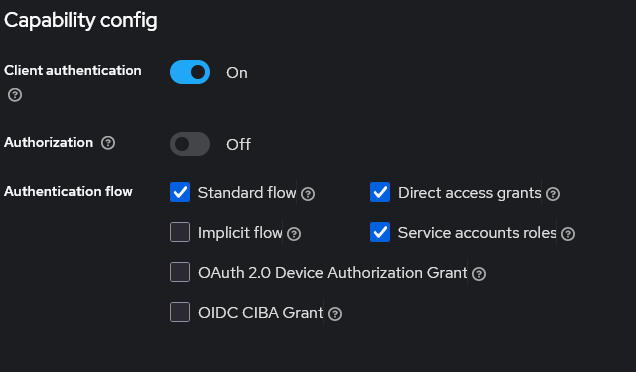

# Витрина интернет-магазина

Веб-приложение «Витрина интернет-магазина», написанное с использованием с использованием Spring Boot на реактивном стеке технологий.
! Внимание. Для запуска приложения необходимо наличие установленного Docker.
## Использование

Для запуска тестов использовать команду:

```sh
./gradlew :payment-service:unit
```
```sh
./gradlew :internet-shop:unit
```

После того как поднимутся все контейнеры, нужно зайти в keycloak по адресу

```
http://localhost:8180/
```

Создать клиента shop


и прописать секрет для контейнера shop-app в docker-compose файле (SPRING_SECURITY_OAUTH2_CLIENT_REGISTRATION_CLIENT_SECRET),
после чего перезапустить этот контейнер и приложение будет доступно по адресу:

```
http://localhost:8080/shop/product
```

Для запуска в докере вместе с PostgreSQL и запуска его на порту 8080 выполнить:

```sh
docker compose up
```
Для остановки сервисов:

```sh
docker compose stop
```
После запуска приложение будет доступно по адресу:

```
http://<адрес контейнера>/shop/product
```